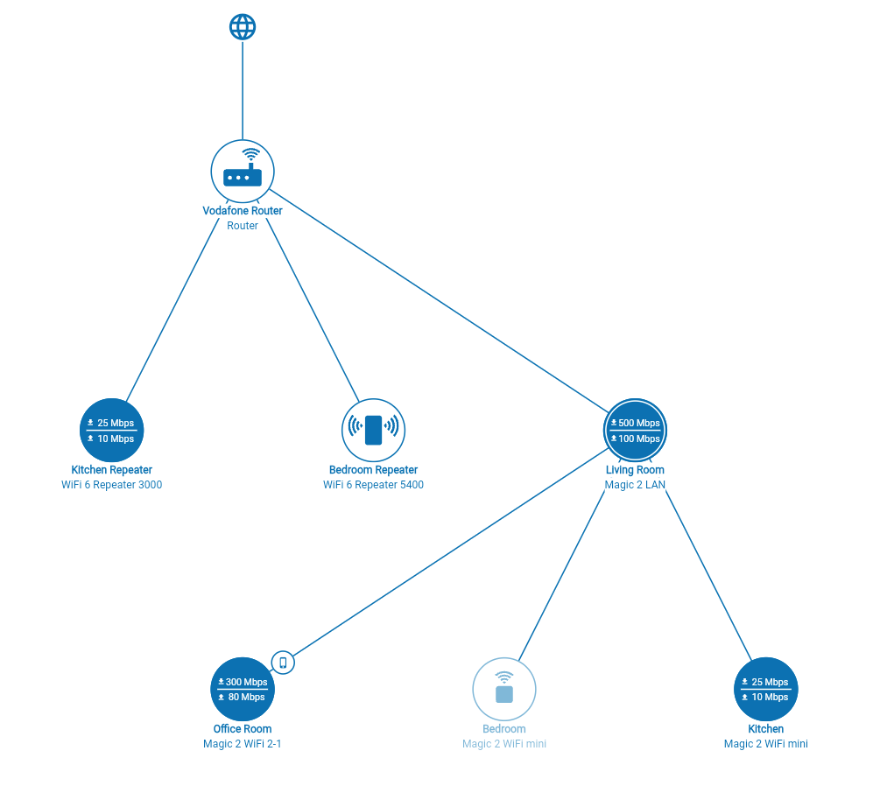

Network Graph
=============

Flutter GraphView package is used to display data in graph structures. It can display Tree layout, Directed and Layered graph. For use in devolo GmbH's Home Network app, we create our own **Network Graph** based on existing foundational work in graphview package, specifically the layered graph implementation of Sugiyama et. al. 



Overview
========
The core implementation of NetworkGraph is under `/lib/networkgraph` folder. For use in app or website, use the `NetworkGraphViewWrapper` class, which requires the following input:

1. `Graph`: A `Graph` object (from GraphView package) that contains a list of `Node`s and `Edge`s. 
    - A Node is to be created with unique identifier:
        ```
        Node node = Node.Id(1);
        ```
    - An Edge is created by specifying two Nodes:
        ```
        graph.addEdge(node1, node2);
        ```
2. `NetworkNode`: The widget that is used to visualize each node in the graph. This widget is ported from the Home Network app (used to visualize each devolo device) and takes the following input:
    ```
    name: 'Device', // Name of the device
    icon: 'assets/devolo_adapter_wifi.svg', // A SVG icon for the device
    id: '${graph.nodes.indexOf(element)}', // A unique ID for the device
    productName: 'Product name', // For example, Magic 2 LAN
    type: 'unused', 
    uplinkSpeedInMbps: 20,
    downlinkSpeedInMbps: 50,
    showSpeeds: false, // Whether speeds should be shown in the network graph
    isConnectedToCurrentClient: false, // Whether the current client (e.g., the desktop you are using to view the app) is connected to this devolo device
    isOffline: false, // Whether the device is online / reachable
    isEasyMeshController: false, // Whether the device is the EasyMesh controller
    onDeviceTap: (node) {} // A callback function that handles taps / clicks on the device
    ```

## `NetworkGraphViewWrapper`
- Returns a network graph that can be zoomed in using pinch gestures and panned using one-finger pan. This interaction is made possible using [`IntearctiveViewer`](https://api.flutter.dev/flutter/widgets/InteractiveViewer-class.html) widget.
- Uses a custom implemented `MeasureWidget` class to detect the size of the graph. This information is used to set the 
    1. zoom factor of the graph inside an `InteractiveViewer` widget so that the entire graph is visible in the available space
    2. horizontal offset in the graph so that the graph is horizontally centered in the viewport
- The zoom factor is capped at 1.35 to prevent excessive zooming on large screens.
- The zoom factor is mapped to a `DetailLevel`, which can be used by the `NetworkNode` to progressively disclose more details in the graph (this is still a work-in-progress).
- In case the entire device width or height is not usable for the graph, the "used up" space needs to be specified via `heightOffset` and `widthOffset` parameters of `NetworkGraphConfiguration` class. 

## `NetworkGraphConfiguration`
This class contains the following parameters used to customize the graph:
- `orientation`: The orientation of the graph, e.g., `ORIENTATION_TOP_BOTTOM` (default), `ORIENTATION_LEFT_RIGHT`, and `ORIENTATION_BOTTOM_TOP`.
- `heightOffset` and `widthOffset`: The `NetworkGraphViewWrapper` sets the zoom factor and position by comparing the graph dimensions to the screen dimensions. If the screen dimensions are not completely usable by the graph, e.g., because of padding and widgets, this *'offset'* can be accounted for by these parameters.
- `levelSeparation` and `nodeSeparation`: Used to specify the vertical distance between each level of the graph and horizontal distance between nodes in a level respectively.
- `iterations`: The number of iterations of the Sugiyama Algorithm to compute the positions of the nodes.
- `bendPointShape`: Used to specify shape of edges in the graph, one of `CurvedBendPointShape`, `SharpBendPointShape` (default for `NetworkGraph`), or `MaxCurvedBendPointShape`.
- `coordinateAssignment`: Used to specify how the center of the nodes should be calculated for drawing edges, defaults to `CoordinateAssignment.Average`.
- `addTriangleToEdge`: A boolean used to indicate if edges are directed or undirected (default).
- `foregroundColor` and `backgroundColor`: Used to specify the graph-drawing colors.

## NetworkNodeConfiguration
This class contains the following parameters used to customize how each node in the graph is drawn (using the `NetworkNode` widget):
- `showEasyMeshInformation`: A boolean flag used to indicate if EasyMesh information (i.e., marking the controller) is to be shown in the graph. The default value is `false`.
- `foregroundColor`, `backgroundColor`, and `offlineForegroundColor`: Used to specify the node-drawing colors.
- `bodyTextStyle`, `bodySecondaryTextStyle`, and `bodySmallTextStyle`: Used to specify `TextStyle` for text used to display nodes.
- `maxTextScaleFactor`: The `TextScaleFactor` cap at which the text should stop resizing, defaults to `1.1`.

Example
=======
For a sample usage of `NetworkGraphViewWrapper`, see `/example/lib/network_graph.dart`.

Specifying Network Configuration Using JSON
===========================================
It is possible to provide a network configuration as a JSON file input. A working example is available in `/webview/lib/network_graph.dart`. 

The JSON file has the following structure:

```
[
  {
    "id": 1,
    "product_name": "Internet",
    "user_name": "Internet",
    "connected_to": [
      2
    ],
    "show_speed": false,
    "is_connected_to_client": false,
    "live": true,
    "is_easymesh_controller": false
  },
  {
    "id": 2,
    "product_name": "Router",
    "user_name": "Vodafone Router",
    "connected_to": [
      3,
      4,
      5
    ],
    "show_speed": false,
    "is_connected_to_client": false,
    "live": true,
    "is_easymesh_controller": false
  },
  {
    "id": 3,
    "product_name": "WiFi 6 Repeater 3000",
    "user_name": "Kitchen Repeater",
    "connected_to": [],
    "upload_speed": "10",
    "download_speed": "25",
    "show_speed": true,
    "is_connected_to_client": false,
    "live": true,
    "is_easymesh_controller": false
  },
  {
    "id": 4,
    "product_name": "WiFi 6 Repeater 5400",
    "user_name": "Bedroom Repeater",
    "connected_to": [],
    "upload_speed": "10",
    "download_speed": "60",
    "show_speed": false,
    "is_connected_to_client": false,
    "live": true,
    "is_easymesh_controller": false
  },
  {
    "id": 5,
    "product_name": "Magic 2 LAN",
    "user_name": "Living Room",
    "connected_to": [
      6,
      7,
      8
    ],
    "upload_speed": "100",
    "download_speed": "500",
    "show_speed": true,
    "is_connected_to_client": false,
    "live": true,
    "is_easymesh_controller": true
  },
  {
    "id": 6,
    "product_name": "Magic 2 WiFi 2-1",
    "user_name": "Office Room",
    "connected_to": [],
    "upload_speed": "80",
    "download_speed": "300",
    "show_speed": true,
    "is_connected_to_client": true,
    "live": true,
    "is_easymesh_controller": false
  },
  {
    "id": 7,
    "product_name": "Magic 2 WiFi mini",
    "user_name": "Bedroom",
    "connected_to": [],
    "upload_speed": "10",
    "download_speed": "50",
    "show_speed": false,
    "is_connected_to_client": false,
    "live": false,
    "is_easymesh_controller": false
  },
  {
    "id": 8,
    "product_name": "Magic 2 WiFi mini",
    "user_name": "Kitchen",
    "connected_to": [],
    "upload_speed": "10",
    "download_speed": "25",
    "show_speed": true,
    "is_connected_to_client": false,
    "live": true,
    "is_easymesh_controller": false
  }
]
```

The JSON format and arguments are rather straightforward. Provide an array of `Node` objects with the arguments above, and specify the edges via `connected_to` array. Each object contains the parameters required to build the graph as well as render the `NetworkNode` widget.

The `webview` project includes a "Upload file" button that can be used to upload the JSON file. The contents of recently uploaded JSON file is cached across sessions.


Future Work
===========
☐ Using a `LayoutBuilder`, rebuild the network graph when there is a change in layout (e.g., screen resizes)  
☐ Support drag & drop of JSON files to change the network graph
☐ Set the distance between each graph level and spacing between sibling nodes dynamically based on the available screen dimensions  
☐ Visualize network configuration over time using animations and optional playback controls

License
=======

MIT License

Copyright (c) 2020 Nabil Mosharraf

Permission is hereby granted, free of charge, to any person obtaining a copy
of this software and associated documentation files (the "Software"), to deal
in the Software without restriction, including without limitation the rights
to use, copy, modify, merge, publish, distribute, sublicense, and/or sell
copies of the Software, and to permit persons to whom the Software is
furnished to do so, subject to the following conditions:

The above copyright notice and this permission notice shall be included in all
copies or substantial portions of the Software.

THE SOFTWARE IS PROVIDED "AS IS", WITHOUT WARRANTY OF ANY KIND, EXPRESS OR
IMPLIED, INCLUDING BUT NOT LIMITED TO THE WARRANTIES OF MERCHANTABILITY,
FITNESS FOR A PARTICULAR PURPOSE AND NONINFRINGEMENT. IN NO EVENT SHALL THE
AUTHORS OR COPYRIGHT HOLDERS BE LIABLE FOR ANY CLAIM, DAMAGES OR OTHER
LIABILITY, WHETHER IN AN ACTION OF CONTRACT, TORT OR OTHERWISE, ARISING FROM,
OUT OF OR IN CONNECTION WITH THE SOFTWARE OR THE USE OR OTHER DEALINGS IN THE
SOFTWARE.